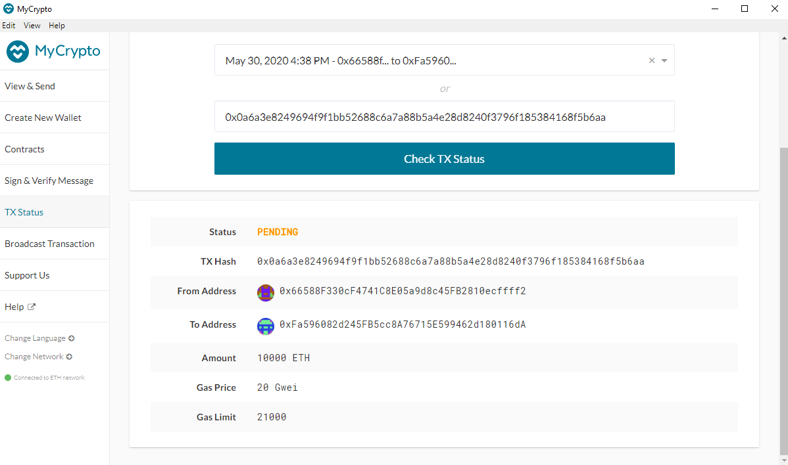

# blockchain_python-homework
Unit 19 Blockchain-Python homework.

Hi Team, Welcome to the Python Universal Wallet that supports BTC, ETH, and BTC TEST-NET coins and ETH and BTC-TEST transactions.
It was built using PHP, bit (Bitcoin's library) and web3 (Ethereum's Library).

Please follow the following transactions to use the wallet:

### 1. Derive Wallets:
def derive_wallets(mnemonic, coin, numderive):
    command = f'php ./derive -g --mnemonic="{mnemonic}" --cols=path,address,privkey,pubkey,pubkeyhash,xprv,xpub --coin="{coin}" numderive="{numderive}" --format=json'
    p = subprocess.Popen(command, stdout=subprocess.PIPE, shell=True)
    (output, err) = p.communicate()
    p_status = p.wait()
    keys = json.loads(output)
    return keys

### 2. Linking the transaction signing libraries:
def priv_key_to_account(coin, priv_key):
    if coin == ETH:
        return Account.privateKeyToAccount(priv_key)
    elif coin == BTCTEST:
        return PrivateKeyTestnet(priv_key)

### 3. Setting Ethereum/Bitcoin 
eth_acc = priv_key_to_account(ETH, derive_wallets(mnemonic, ETH, 5)[0]['privkey'])
btc_acc = priv_key_to_account(BTCTEST, derive_wallets(mnemonic, BTCTEST, 5)[0]['privkey'])

### 4. Creating the Transaction:
def create_tx(coin, account, recipient, amount):
    if coin == ETH:
        gasEstimate = w3.eth.estimateGas({"from": eth_acc.address, "to": recipient, "value": amount})
        return {
            "from": eth_acc.address,
            "to": recipient,
            "value": amount,
            "gasPrice": w3.eth.gasPrice,
            "gas": gasEstimate,
            "nonce": w3.eth.getTransactionCount(eth_acc.address)
        }
    elif coin == BTCTEST:
        return PrivateKeyTestnet.prepare_transaction(btc_acc.address, [(recipient, amount, BTC)])
        
### 5. Sending the Transaction:
def send_tx(coin, account, recipient, amount):
    txn = create_tx(coin, account, recipient, amount)
    if coin == ETH:
        signed_txn = eth_acc.sign_transaction(txn)
        result = w3.eth.sendRawTransaction(signed_txn.rawTransaction)
        print(result.hex())
        return result.hex()
    elif coin == BTCTEST:
        signed_txn = btc_acc.sign_transaction(txn)
        result = NetworkAPI.broadcast_tx_testnet(signed_txn)
        
Now that you've ran these functions, you have the choice of either making Ethereum or BTC-Test Transactions. You can run these transactions in Bash or within your Python script. If your running these transactions within your Python script, run the following functions:

### 6. Executing Functions
create_tx(ETH, eth_acc, '0x66588F330cF4741C8E05a9d8c45FB2810ecffff2', 10000)
send_tx(ETH, eth_acc, '0x527775c4b25b14721ad1dB9D190dA5a5d5aF3a91', 10000)

send_tx(BTCTEST, btc_acc, 'ms4mjqE7mghTeL2nrmLq9LaxzcP3KZHvE4', .005)

If you would like to execute the code from bash, run the following code:

from wallet import *

and then run the preceding functions.

Please see below for transaction screenshots:

- Funding Account and Obtaining Balance

- Sending a Transaction and Obtaining Transaction Details

- BTC Test Faucet, Obtaining BTC Test-Net funds

- BTC Test-Net Transactions

- BTC Test-Net Transaction Details

